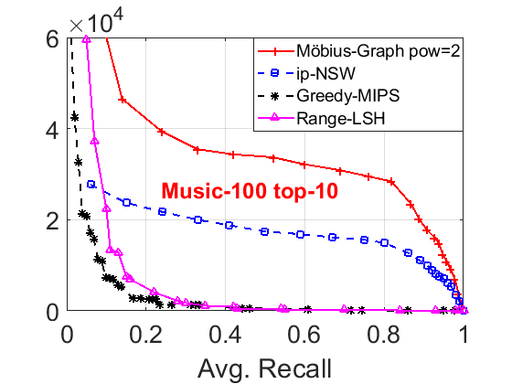
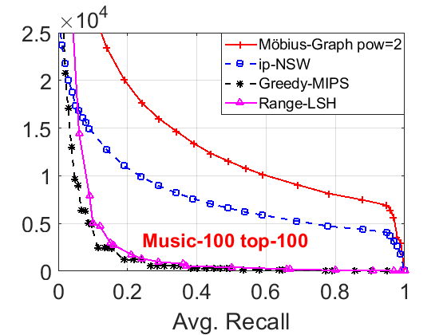
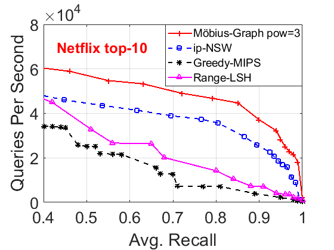
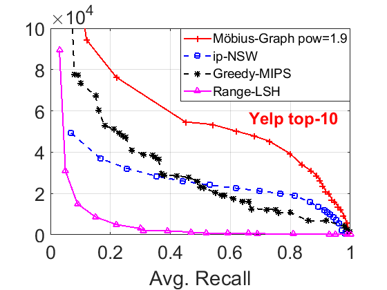
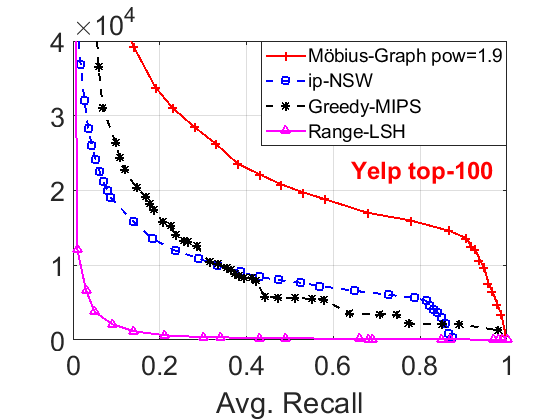

# Möbius Transformation for Fast Inner Product Search on Graph

Welcome to the Möbius GitHub!

Möbius is a graph-based approximate nearest neighbor search algorithm for Maximum Inner Product Search (MIPS). Möbius implements the Möbius transformation algorithm of [Möbius Transformation for Fast Inner Product Search on Graph](https://papers.nips.cc/paper/2019/file/0fd7e4f42a8b4b4ef33394d35212b13e-Paper.pdf) in [NeurIPS 2019](https://nips.cc/Conferences/2019). The graph-based searching implementation is derived from the codebase of [SONG](https://github.com/sunbelbd/song).

## Performance
Möbius has the **best** searching performance over other MIPS solutions. Here we present the performance comparison on 3 datasets for the MIPS problem:

**Musici-100**

 

**Netflix**

 

**Yelp**

 

## Installation and Usage

### Prerequisites
We have tested Möbius on the following versions of prerequisites.
```
g++ 5.4.0, 9.3.0
```
Other versions may also work. Please ensure that your C++ compiler supports the C++11 standard.

### Build Graph Index
We first build a graph index using the Möbius transformation algorithm.
Here we include a toy example dataset extracted from SIFT (`base.txt` and `test.txt`) to walk through the process.
```
Usage: ./build_graph.sh <build_data> <row> <dimension> [mobius_pow]
For example: ./build_graph.sh base.txt 1000 128
With the optional mobius_pow argument: ./build_graph.sh base.txt 1000 128 1.9
```
Here `[mobius_pow]` is an optional argument (with default value 2.0). You can tune this parameter to obtain the best performance.

### Run Searching Algorithm
```
Usage: ./test_query.sh <query_data> <built_graph_row> <built_graph_dimension> <search_budget> [display top k]
For example: ./test_query.sh test.txt 1000 128 100
Use display top 5: ./test_query.sh test.txt 1000 128 100 5
```
The output is the zero-based base vector indices. One line corresponds to one query.
Note that `<built_graph_row>` and `<built_graph_dimension>` have to be the row and dimensions of the ***base data*** (the data we built the index on).

### Python Interface
We create a python interface for easier use.
Note that the conversion to numpy array to c-style array may yield some overhead.
***For the best performance practice, please use the original C++ library.***
```
make mobius.so
python test.py
```
Please read `test.py` for more details. Make sure you have compiled `mobius.so` and put `interface.py` in the current working directory (or python path directory).

## FAQ
1. How can I change the parameters of the proximity graph, e.g., degree, searching budget in graph construction?
We have two macros in *config.h*: `SEARCH_DEGREE` and `CONSTRUCT_SEARCH_BUDGET`. You can change them to your desired values.

## Reference

Reference to cite when you use Möbius in your paper:
```
@inproceedings{DBLP:conf/nips/ZhouTX019,
  author    = {Zhixin Zhou and
               Shulong Tan and
               Zhaozhuo Xu and
               Ping Li},
  title     = {M{\"{o}}bius Transformation for Fast Inner Product Search on
               Graph},
  booktitle = {Advances in Neural Information Processing Systems 32: Annual Conference
               on Neural Information Processing Systems 2019, NeurIPS 2019, December
               8-14, 2019, Vancouver, BC, Canada},
  pages     = {8216--8227},
  year      = {2019}
}
```
